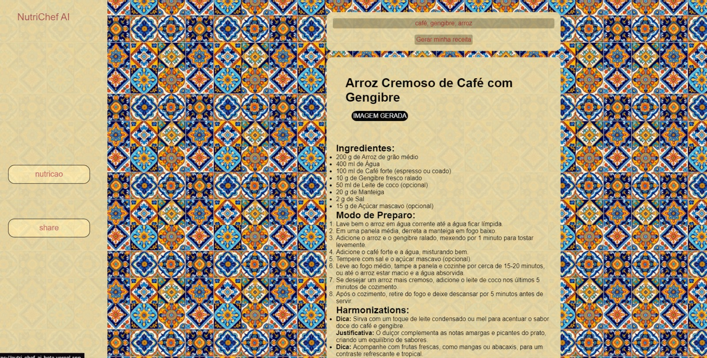

# [NutriChefAI](https://nutri-chef-ai-beta.vercel.app)



> Gerador de receitas criativas com uso de inteligência artificial a partir de ingredientes dados pelo o usuário

## 💻 Features

- Geração de receitas por meio da inteligência artificial GeminAI
- Geração da tabela nutricional referente a receita gerada

## 💾 Tecnologias Usadas

* Next.js - Usado no Front-End
* Node.js - Usado no Back-End
* Vercel - Usado para hospedar o site
* GeminAI - API para geração das receitas
* Spoonacular - API para receber a tabela nutricional

### Requisitos

Instalações necessárias:
- Next.js
- Node.js

## 📄 Documentação

[Notion]()

## 🚀 Getting Started

Para rodar localmente:

```bash
npm run dev
# or
yarn dev
# or
pnpm dev
# or
bun dev
```

Acesse [http://localhost:3000](http://localhost:3000) no seu navegador para ver o resultado.

## ☕ Usando NutriChefAI

Para usar NutriChefAI, siga estas etapas:

```
1. Digite os ingredientes que você tem disponível separados por ponto e vírgula ;
2. Aguarde a receita ser gerada ;)
```

### Ajustes e melhorias

O projeto ainda está em desenvolvimento e as próximas atualizações serão voltadas para as seguintes tarefas:

- [ ] Geração de imagem de inspiração
- [ ] Compartilhamento de receitas
- [ ] Pesquisa por ingredientes otimizada
- [ ] Melhora no design


## 🤝 Colaboradores

Agradecemos às seguintes pessoas que contribuíram para este projeto:

- [Fabrício Aranha <fa3>](https://github.com/Faranha300)
- [Filipe Bezerra <fbms>](https://github.com/BezerraFilipe)
- [Pedro Sarmento <phsp>](https://github.com/PedroSarment)
- [Peterson Jesus <pjfm>](https://github.com/Petersonnave)
- [João Motta <jmsm3>](https://github.com/jmsmotta)
